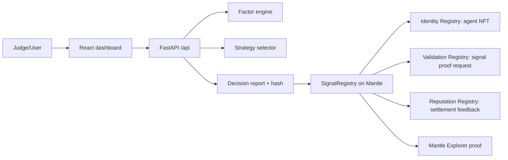

# QuantAgent Alpha Registry

QuantAgent turns crypto factor research into an explainable, backtestable, and
on-chain auditable AI trading agent on Mantle.

## Built MVP

- **Factor engine** — adapted from `crypto_factor_module` (market, derivative, on-chain factors)
- **Strategy selector** — SuperTrend / Bollinger / MACD+Bollinger with regime classification
- **API** — FastAPI with live Binance fallback to `data/sample/`
- **Dashboard** — React + Recharts factor radar, benchmark chart, Agent Passport, Mantle proof panel
- **Contract** — `SignalRegistry.sol` provides an ERC-8004-inspired identity, validation, and reputation registry
- **Byreal adapter** — execution-intent layer for RealClaw/Byreal routing, with safe simulation fallback
- **Agent memory** — FinMem-inspired settlement memory with recency, importance, and PnL-impact retrieval
- **Multi-agent context** — QuantAgent-inspired indicator, flow, memory, reputation, and risk critic reports

## Why it is different

Most AI trading demos stop at an answer. QuantAgent Alpha Registry records a
decision trail:

- factor scores and strategy reasoning are generated off-chain;
- the decision report is hashed;
- the hash and metadata are recorded through a Mantle proof layer;
- a registered agent identity can request validation and receive reputation feedback;
- the UI keeps risk caveats and proof mode visible.

## Academic Foundations

This project fuses production code from four academic pillars. Each source
paper drives specific runtime modules, not just a citations list.

| Paper | Code Location | What It Drives |
|-------|--------------|----------------|
| **FinMem** (2024) – Episodic Memory for Financial RL | `packages/agent-memory/` | JSONL memory store with recency, importance, similarity, and PnL-impact retrieval; `/api/settle` → `MemoryRecord.from_analysis()` → `store.append()` → next `/api/analyze` consumes retrieved memories |
| **QuantAgent** (2025) – Self-Improving LLM Agent | `packages/strategy-selector/selector.py` | Outer-loop PnL self-reflection: losing >50 bps → deduct confidence 0.12 + add warning; winning >50 bps → reward 0.02; reflection text injected into next System Prompt |
| **QuantAgent** (2025) – Multi-Agent Collaboration | `packages/agent-orchestrator/` | Five deterministic sub-agents (Indicator, Flow, Memory, Reputation, Risk Critic); reports fed into selector via `multi_agent_context` |
| **AlphaGPT** (2023) – LLM-Generated Alpha Factors | `packages/strategy-selector/selector.py` | Dynamic-rank alpha formula with regime-aware weights (e.g., `decay_linear(momentum,6)`); conservative mode adjusts volatility penalty from 0.30 → 0.45 |
| **EIP-8004** – Trustless Agent Identity | `contracts/contracts/SignalRegistry.sol` | ERC-8004-inspired identity (agent NFT), validation (proof request), and reputation (settlement feedback) on Mantle; zkML proofHash anchor reserved for future verifiability |

## Contract Architecture

| Contract | Owner | Role |
|----------|-------|------|
| `SignalRegistry.sol` | **Project-deployed** (own contract) | Agent identity NFT, validation proof requests, reputation settlement — ERC-8004-inspired |
| `QuantAgentExecutor.sol` | **Project-deployed** (own contract) | zkTLS proof gate: verifies Reclaim-compatible `IReclaim.verifyProof` before anchoring execution intents |
| ERC-8004 IdentityRegistry | External/official registry (read-only) | Standard ERC-8004 identity lookups |
| ERC-8004 ReputationRegistry | External/official registry (read-only) | Standard ERC-8004 reputation queries |

**Reclaim compatibility note**: `QuantAgentExecutor` defines a minimal `IReclaim` interface
matching the official `@reclaimprotocol/verifier-solidity-sdk` struct layout (see
`contracts/contracts/QuantAgentExecutor.sol`). This avoids importing the SDK's inline-assembly
source during compilation while calling the same on-chain verifier. The `RECLAIM_*` env vars are
reserved for future full SDK integration.

**x402 pipeline**: current status is simulation / facilitator-ready. The `X402Client`
in `services/api/app/x402.py` parses HTTP 402 metadata and prepares Blocky402
payment intents deterministically; a live facilitator call can replace
`prepare_payment` without touching callers.

**Byreal / RealClaw**: current status is adapter / simulation-ready. Real SDK
credentials configured via `BYREAL_API_BASE` / `BYREAL_API_KEY` will switch
from simulation to live RFQ execution-intent routing.

## Full End-to-End Flow

```mermaid
flowchart LR
  A["Analyze: factor scores + strategy reasoning"] --> B["FinPos PositionPlan: direction, exposure, risk"]
  B --> C["QTMRL A2C: policy-weighted action recommendation"]
  C --> D["RFQ ExecutionIntent: route type, venue, slippage"]
  D --> E["zkTLS DataProof: Reclaim-compatible proof gate"]
  E --> F["Record Signal: SignalRegistry anchor on Mantle"]
  F --> G["Settle: PnL, drawdown, win rate feedback"]
  G --> H["ERC-8004 Feedback: identity + reputation update"]
```



## Architecture



## Quick start

Localhost is for development only. The final DoraHacks submission must use a
public app URL and must not submit `localhost`, `127.0.0.1`, or a private LAN
address as the demo link.

### 1. Smoke test (offline)

```powershell
cd "c:\Users\yhy05\Desktop\黑客松"
python scripts\smoke_test.py
```

### 2. API

```powershell
.\scripts\run_api.ps1
```

### 3. Web

```powershell
.\scripts\run_web.ps1
```

Open `http://localhost:5173` for local development. Click **Analyze**, then
**Record on Mantle**.

For final submission, deploy the app publicly. The simplest path is a single
FastAPI service that serves the built React dashboard and exposes API routes
under `/api/*`.

## API

| Endpoint | Description |
|----------|-------------|
| `GET /api/health` | Health check |
| `GET /api/assets` | BTC, ETH, SOL |
| `POST /api/analyze` | Factors + strategy + decision report |
| `POST /api/record-signal` | Mantle proof or explicit demo-mode proof |
| `GET /api/agent` | Agent identity and reputation status |
| `POST /api/agent/register` | Register an ERC-8004-inspired agent identity |
| `GET /api/byreal/status` | Byreal / RealClaw adapter status |
| `POST /api/settle` | Compute PnL feedback and write reputation when configured |
| `GET /api/memory` | FinMem-inspired settlement memory summary and recent records |
| `GET /api/demo/sample` | Sample data preview |

## Mantle contract

```powershell
cd contracts
npm install
npm run compile
# Copy contracts/.env.example to contracts/.env and set MANTLE_PRIVATE_KEY, then:
npm run deploy:sepolia
```

Copy `.env.example` to root `.env`, then set the deployed address as
`SIGNAL_REGISTRY_ADDRESS`.

After deployment, call `POST /api/agent/register`, read the `Registered` event
for the new `agentId`, then set `AGENT_ID` and `VALIDATOR_ADDRESS`. With those
configured, `POST /api/record-signal` uses the identity + validation path
instead of the legacy signal recorder.

Without `SIGNAL_REGISTRY_ADDRESS` and `MANTLE_PRIVATE_KEY`, the app stays in
demo-proof mode. This keeps the judge flow reliable, but the final judged
submission must disable mock-only posture and include a real Mantle contract,
agent identity, validation request, or explorer transaction.

Set `PRIVATE_MEMPOOL_RPC_URL` when using a protected RPC provider. The API will
prefer that endpoint for transaction broadcasts, while still using dynamic gas
estimation instead of hardcoded gas values.

## Public deployment

See [docs/deployment.md](docs/deployment.md). Before submission, verify:

- public app URL works without localhost;
- `/api/health` reports `status: ok`;
- `Record on Mantle` returns an explorer transaction or a clearly labeled demo
  proof if the contract is intentionally not configured yet.

## Project layout

```text
packages/factor-engine/     # crypto_factors + MVP summary
packages/strategy-selector/ # regime + strategy selection
packages/agent-memory/      # FinMem-inspired JSONL memory retrieval
packages/agent-orchestrator/# QuantAgent-inspired multi-agent context
services/api/               # FastAPI
apps/web/                   # React dashboard
contracts/                  # SignalRegistry.sol
data/sample/                # BTC, ETH, SOL offline snapshots
```

## Docs

See [STATUS.md](STATUS.md), [GOALS.md](GOALS.md), [STRUCTURE.md](STRUCTURE.md), and `docs/` for hackathon scope and judging alignment.

Submission-focused docs:

- [docs/deployment.md](docs/deployment.md)
- [docs/api-examples.md](docs/api-examples.md)
- [docs/architecture-diagram.md](docs/architecture-diagram.md)
- [docs/proof-model.md](docs/proof-model.md)
- [docs/submission-story.md](docs/submission-story.md)
- [docs/paper-source-integration.md](docs/paper-source-integration.md)
- [docs/launch-checklist.md](docs/launch-checklist.md)
- [docs/repo-hygiene.md](docs/repo-hygiene.md)
- [submissions/dorahacks/pitch.md](submissions/dorahacks/pitch.md)
- [submissions/dorahacks/final-checklist.md](submissions/dorahacks/final-checklist.md)
