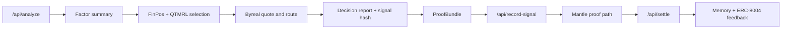

# QuantAgent Alpha Registry

QuantAgent Alpha Registry is an ERC-8004-compatible Mantle trading-agent
prototype. It turns factor research into a verifiable decision trail:

```text
market data -> factor summary -> FinPos/QTMRL policy -> Byreal route decision
-> ProofBundle -> Mantle signal anchor -> settlement -> reputation feedback
```

The project is built for the Mantle Turing Test / DoraHacks judging context:
transparent agent identity, auditable decision hashes, explicit execution
routing, and clear demo/live boundaries.

## What Is Implemented

- **FastAPI orchestration** under `services/api/`
  - `/api/analyze` builds factor summaries, policy decisions, execution routes, and ProofBundles.
  - `/api/record-signal` anchors the latest decision through the configured Mantle proof path or a labeled demo path.
  - `/api/settle` computes PnL, writes memory, emits TEE/zkTLS proof fields, and builds ERC-8004-compatible feedback.
  - `/api/agent/card` serves a deterministic Agent Registration File with `services`, `x402Support`, `registrations`, and `supportedTrust`.

- **React dashboard** under `apps/web/`
  - Agent Passport with ERC-8004 registry path, identity status, validation status, reputation, and memory.
  - Factor, regime, QTMRL policy, benchmark, route decision, x402 audit, and ProofBundle panels.

- **Strategy stack** under `packages/`
  - Factor engine for market, derivative, and on-chain-compatible factor summaries.
  - FinPos-style direction and position sizing.
  - QTMRL/A2C-inspired policy scoring via `policy_blender.py`.
  - FinMem-inspired settlement memory.
  - QuantAgent-style multi-agent context with indicator, flow, memory, reputation, and risk critic reports.

- **Trust and execution adapters**
  - ERC-8004-compatible Agent Card and adapter boundary.
  - Canonical ProofBundle hash tying decision report, data proof, route decision, TEE, zkTLS, and settlement.
  - Byreal/RealClaw quote -> route -> receipt abstraction with simulation fallback.
  - Reclaim zkTLS and Phala TEE adapters with deterministic fallback fields.
  - x402 payment policy audit with expected alpha vs data cost.

- **Contracts**
  - `SignalRegistry.sol`: project fallback registry for identity-inspired signal anchoring and reputation feedback.
  - `QuantAgentExecutor.sol`: Reclaim-compatible proof gate shape for live zkTLS verification.
  - `ERC8004AgentCard.sol`: on-chain metadata helper for Agent Card experiments.

## Demo And Live Modes

The system is intentionally explicit about mode:

| Mode | Meaning |
|---|---|
| `demo-proof` | No Mantle private key or registry address is configured. The API returns deterministic proof metadata without pretending a transaction happened. |
| `real-onchain` | `SIGNAL_REGISTRY_ADDRESS` and `MANTLE_PRIVATE_KEY` are configured, so signal/reputation writes can submit transactions. |
| `fallback-demo` | ERC-8004-compatible payloads are produced, but official registry writes are not configured. |
| `standard-ready` | Agent ID / registry configuration is present and the standard adapter can surface live registry state. |
| `simulation` | Byreal/Reclaim/TEE/x402 live credentials are absent; structured simulated receipts are returned. |

This lets the demo stay reliable while keeping the upgrade path to live Mantle
infrastructure clean.

## Quick Start

### 1. Verify The Baseline

```powershell
cd "C:\Users\yhy05\Desktop\黑客松"
python -m pytest services\api\tests
python -m unittest discover packages\strategy-selector\tests
python scripts\smoke_test.py
```

### 2. Run The API

```powershell
.\scripts\run_api.ps1
```

Useful endpoints:

```text
GET  /api/health
GET  /api/agent/card
POST /api/analyze
POST /api/record-signal
POST /api/settle
GET  /api/memory
```

### 3. Run The Web App

```powershell
.\scripts\run_web.ps1
```

Open `http://localhost:5173` for local development only. Final submission links
must use a public URL.

### 4. Build Frontend And Contracts

```powershell
cd apps\web
npm run build

cd ..\..\contracts
npm run compile
```

## Environment

Copy `.env.example` to `.env` and configure only the live integrations you want
to enable.

Core Mantle proof path:

```env
MANTLE_RPC_URL=https://rpc.sepolia.mantle.xyz
MANTLE_CHAIN_ID=5003
SIGNAL_REGISTRY_ADDRESS=
MANTLE_PRIVATE_KEY=
AGENT_ID=
VALIDATOR_ADDRESS=
```

ERC-8004 and Agent Card:

```env
AGENT_CARD_BASE_URL=https://your-public-api.example.com
AGENT_URI=https://your-public-api.example.com/api/agent/card
ERC8004_IDENTITY_REGISTRY_ADDRESS=
ERC8004_REPUTATION_REGISTRY_ADDRESS=
ERC8004_VALIDATION_REGISTRY_ADDRESS=
```

Optional live adapters:

```env
BYREAL_API_BASE=
BYREAL_API_KEY=
RECLAIM_APP_ID=
RECLAIM_APP_SECRET=
RECLAIM_VERIFIER_ADDRESS=
PHALA_TEE_ENABLED=false
PHALA_ENCLAVE_ENDPOINT=
PHALA_API_KEY=
BLOCKY402_FACILITATOR_URL=
X402_WALLET_ADDRESS=
```

## Agent Card Preview

```powershell
python scripts\register_agent_card.py
```

The script prints the canonical Agent Card endpoint and payload. For final
submission, host that card publicly, set `AGENT_URI`, and register it through
the official ERC-8004 Identity Registry path or the project fallback registry.

## API Flow



## Repository Layout

```text
apps/web/                    React dashboard
services/api/                FastAPI orchestration and trust adapters
packages/factor-engine/      Factor computation
packages/strategy-selector/  Strategy, FinPos, QTMRL policy
packages/agent-memory/       Settlement memory and ATLAS prompt variants
packages/agent-orchestrator/ Multi-agent context and A2C policy skeleton
contracts/                   Mantle contracts and Hardhat config
data/sample/                 Offline BTC/ETH/SOL snapshots
docs/                        Deployment, proof, and judging notes
submissions/dorahacks/       Submission materials
```

## Current Submission Gap

The codebase is ready for a public demo and live integration configuration, but
the final judged submission should still add:

- public app URL;
- deployed Mantle contract or official ERC-8004 registry transaction;
- registered Agent Card URI and `agentId`;
- at least one real Mantle explorer transaction;
- demo video and final DoraHacks submission links.
