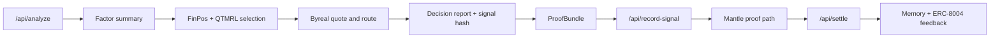

# QuantAgent Alpha Registry

QuantAgent Alpha Registry 是一个面向 Mantle 图灵测试黑客松（The Turing Test
Hackathon 2026）的 ERC-8004 兼容型 AI 量化交易 Agent 原型系统。它将前沿学术研究
（FinPos、QTMRL、ATLAS、AlphaQuanter）与 Web3 密码学基础设施（zkTLS、TEE、x402）
深度融合，构建了从因子研究到链上可验证决策的完整闭环：

```text
market data → factor summary → FinPos/QTMRL policy → Byreal route decision
→ ProofBundle → Mantle signal anchor → settlement → reputation feedback
        ↑ zkTLS provenance   ↑ TEE attestation   ↑ x402 payment
```

**核心赛道**: AI Trading & Strategy / Agentic Wallets & Economy / AI Alpha & Data

**技术亮点**:
- 🔬 **FinPos 双智能体仓位感知架构** — 方向决策 + 数量风险决策，多时间尺度复合奖励
- 🧠 **QTMRL/A2C 强化学习策略** — Actor-Critic 网络替代静态权重，自适应市场演化
- 🎯 **ATLAS Adaptive-OPRO** — 基于性能反馈的提示词自动进化管道
- 🛡️ **ERC-8004 去信任代理协议全栈集成** — Identity / Reputation / Validation 三大注册表
- 🔐 **Reclaim Protocol zkTLS** — 零知识数据溯源，消除 Web2 API 信任断层
- 🔒 **Phala Network TEE** — 硬件级隐私保护，策略 IP 军事级加密
- ⛽ **Mantle 原生 Gas 动态估算** — L2 排序器收入、DEX 流动性、MNT 质押收益因子
- 💰 **x402 机器支付协议** — 智能体自主获取付费数据，M2M 微支付闭环
- ⚡ **Byreal/RealClaw RFQ 执行引擎** — 零滑点、零 MEV 攻击的链下询价路由

## 已实现功能

### 算法层 — 前沿多智能体决策
| 模块 | 学术来源 | 工程落点 |
|------|---------|---------|
| **FinPos 双智能体架构** | Position-Aware Trading Agent (2025) | `strategy-selector/finpos.py` — DirectionDecisionAgent + QuantityRiskDecisionAgent |
| **多时间尺度奖励** | FinPos Multi-timescale Rewards | `strategy-selector/finpos_rewards.py` — 即时/短期/中期窗口 + 复合得分 |
| **QTMRL/A2C 策略引擎** | QTMRL + AlphaQuanter (2025) | `agent-orchestrator/qtmrl.py` — Actor-Critic 网络 + 主动探索触发 |
| **ATLAS Adaptive-OPRO** | Adaptive Trading with LLM Agents (2025) | `services/api/app/atlas_opro.py` — 性能驱动的提示词变异与筛选 |
| **FinMem 情节记忆** | Financial Memory (2024) | `agent-memory/store.py` — JSONL 存储 + 新近度/PnL 影响力检索 |
| **多智能体编排中枢** | QuantAgent Multi-Agent | `agent-orchestrator/graph.py` — Indicator/Flow/Memory/Reputation/RiskCritic |

### 执行层 — 防夹击与零滑点
| 模块 | 说明 |
|------|------|
| **Byreal/RealClaw RFQ 路由** | 链下询价引擎，零价格影响、零 MEV 攻击，`services/api/app/byreal.py` |
| **Mantle 原生因子** | DEX 流动性、MNT 质押收益率、L2 排序器收入，`factor-engine/crypto_factors/mantle_native.py` |
| **Gas 费动态估算** | Mantle L2 实时 Gas 费，`services/api/app/gas_estimator.py` |

### 协议层 — ERC-8004 去信任代理
| 注册表 | 合约 | 说明 |
|------|------|------|
| **Identity Registry** | `ERC8004AgentCard.sol` | Agent NFT 铸造 + Agent Card URI 注册 |
| **Reputation Registry** | `SignalRegistry.sol` | 结构化声誉反馈（score + tags + feedbackUri） |
| **Validation Registry** | `QuantAgentExecutor.sol` | zk-proof gate + TEE attestation 验证入口 |

### 密码学层 — 数据溯源与隐私计算
| 技术 | 集成文件 | 说明 |
|------|---------|------|
| **Reclaim zkTLS** | `services/api/app/reclaim.py` | 零知识证明数据来源真实性 |
| **Phala TEE** | `services/api/app/tee.py` | Intel SGX/AMD SEV 硬件级策略隐私 |
| **x402 机器支付** | `services/api/app/x402.py` | HTTP 402 协议 + Blocky402 Facilitator |

### 前端看板
- `apps/web/` — React + TypeScript 仪表板
- Agent Passport / Factor Charts / Regime Strategy / Risk Benchmark / Mantle Proof / Multi-Agent Panel
- 骨架屏加载 (SkeletonPanel) / Gas 费实时显示 / Mantle Explorer 链接跳转 / 响应式布局

## Demo And Live Modes

The system is intentionally explicit about mode:

| Mode | Meaning |
|---|---|
| `demo-proof` | No Mantle private key or registry address is configured. The API returns deterministic proof metadata without pretending a transaction happened. |
| `real-onchain` | `SIGNAL_REGISTRY_ADDRESS` and `MANTLE_PRIVATE_KEY` are configured, so signal/reputation writes can submit transactions. |
| `fallback-demo` | ERC-8004-compatible payloads are produced, but official registry writes are not configured. |
| `standard-ready` | Agent ID / registry configuration is present and the standard adapter can surface live registry state. |
| `simulation` | Byreal/Reclaim/TEE/x402 live credentials are absent; structured simulated receipts are returned. |

This lets the demo stay reliable while keeping the upgrade path to live Mantle
infrastructure clean.

## Quick Start

### 1. Verify The Baseline

```powershell
cd "C:\Users\yhy05\Desktop\黑客松"
python -m pytest services\api\tests
python -m unittest discover packages\strategy-selector\tests
python scripts\smoke_test.py
```

### 2. Run The API

```powershell
.\scripts\run_api.ps1
```

Useful endpoints:

```text
GET  /api/health
GET  /api/agent/card
POST /api/analyze
POST /api/record-signal
POST /api/settle
GET  /api/memory
```

### 3. Run The Web App

```powershell
.\scripts\run_web.ps1
```

Open `http://localhost:5173` for local development only. Final submission links
must use a public URL.

### 4. Build Frontend And Contracts

```powershell
cd apps\web
npm run build

cd ..\..\contracts
npm run compile
```

## Environment

Copy `.env.example` to `.env` and configure only the live integrations you want
to enable.

Core Mantle proof path:

```env
MANTLE_RPC_URL=https://rpc.sepolia.mantle.xyz
MANTLE_CHAIN_ID=5003
SIGNAL_REGISTRY_ADDRESS=
MANTLE_PRIVATE_KEY=
AGENT_ID=
VALIDATOR_ADDRESS=
```

ERC-8004 and Agent Card:

```env
AGENT_CARD_BASE_URL=https://your-public-api.example.com
AGENT_URI=https://your-public-api.example.com/api/agent/card
ERC8004_IDENTITY_REGISTRY_ADDRESS=
ERC8004_REPUTATION_REGISTRY_ADDRESS=
ERC8004_VALIDATION_REGISTRY_ADDRESS=
```

Optional live adapters:

```env
BYREAL_API_BASE=
BYREAL_API_KEY=
RECLAIM_APP_ID=
RECLAIM_APP_SECRET=
RECLAIM_VERIFIER_ADDRESS=
PHALA_TEE_ENABLED=false
PHALA_ENCLAVE_ENDPOINT=
PHALA_API_KEY=
BLOCKY402_FACILITATOR_URL=
X402_WALLET_ADDRESS=
```

## Agent Card Preview

```powershell
python scripts\register_agent_card.py
```

The script prints the canonical Agent Card endpoint and payload. For final
submission, host that card publicly, set `AGENT_URI`, and register it through
the official ERC-8004 Identity Registry path or the project fallback registry.

## API Flow



## Repository Layout

```text
apps/web/                    React dashboard
services/api/                FastAPI orchestration and trust adapters
packages/factor-engine/      Factor computation
packages/strategy-selector/  Strategy, FinPos, QTMRL policy
packages/agent-memory/       Settlement memory and ATLAS prompt variants
packages/agent-orchestrator/ Multi-agent context and A2C policy skeleton
contracts/                   Mantle contracts and Hardhat config
data/sample/                 Offline BTC/ETH/SOL snapshots
docs/                        Deployment, proof, and judging notes
submissions/dorahacks/       Submission materials
```

## 提交检查清单 Submission Checklist

| # | 项目 | 状态 | 说明 |
|---|------|------|------|
| D-1 | 应用公开部署 | ⬜ | Render / HuggingFace Spaces 部署 |
| D-2 | Mantle 测试网合约部署 | ⬜ | 部署 SignalRegistry + QuantAgentExecutor + ERC8004AgentCard |
| D-3 | ERC-8004 Agent 身份注册 | ⬜ | 铸造 Agent NFT，设置 Agent Card URI |
| D-4 | `.env` 环境变量配置 | ⬜ | 配置 RPC / 私钥 / 注册表地址 |
| D-5 | 真实链上信号交易 + 声誉反馈 | ⬜ | 至少一笔 Mantle Explorer 可查交易 |
| D-6 | 2-3 分钟英文演示视频 | ⬜ | 录制完整 demo flow |
| C-1 | Mantle 原生因子 | ✅ | DEX 流动性 / MNT 质押 / L2 排序器收入因子 |
| C-2 | Gas 费动态估算 | ✅ | Mantle L2 实时 Gas 费 API |
| C-3 | 前端 Explorer 链接 | ✅ | txHash → explorer URL 自动跳转 |
| C-4 | 前端生产化打磨 | ✅ | 骨架屏 / 响应式 / Chunk 优化 |
| C-5 | README + 提交材料 | ✅ | 本文档 |
