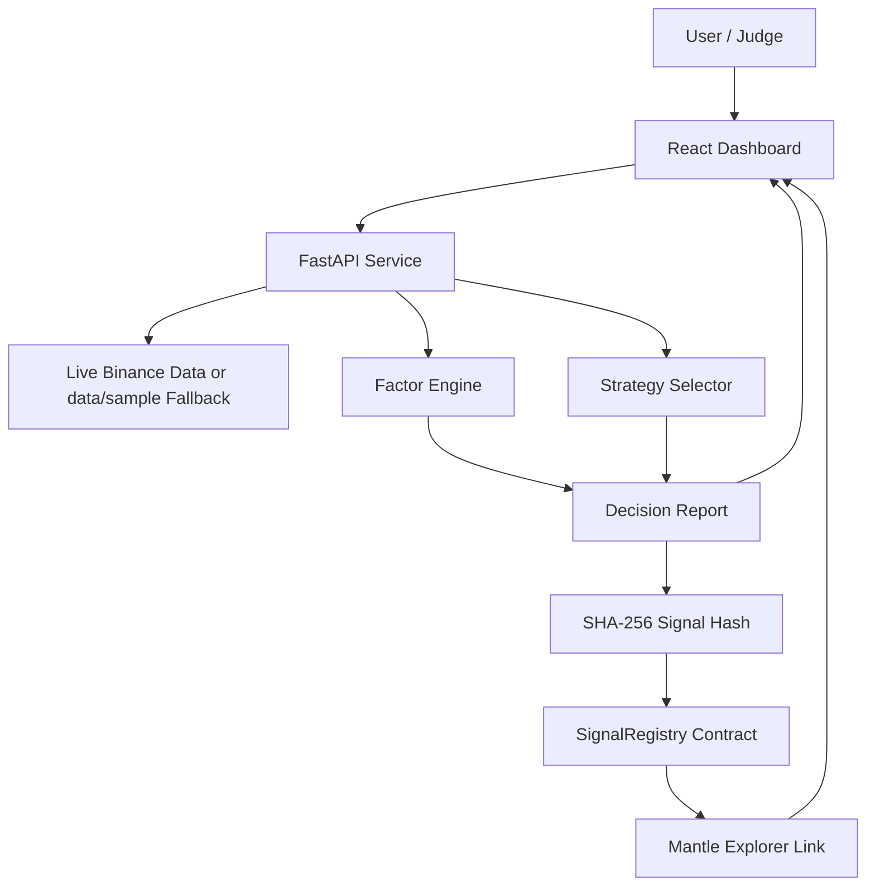

# Architecture Diagram

## Trust Boundary

- Factor computation and strategy selection happen off-chain.
- The full decision report is hashed off-chain.
- Mantle stores the compact proof, not the entire factor matrix.
- Users can compare the report hash with the chain record.

## MVP Boundary

The MVP records decisions only. It does not custody funds and does not
automatically execute trades.
